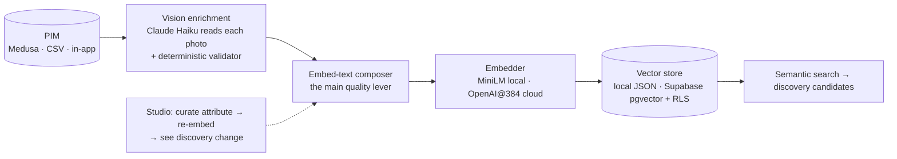

# Intently

**Shoppers describe a situation, not a filter set. Intently returns a small, explained shortlist.**

> *"A black dress for a garden party — it might get cold later, and I hate florals."*
> → two sharp questions if the brief is vague → 8 pieces, each with a one-line reason it fits → a restrained "complete the look" rail (a light layer for the cold evening).

Intently is a working AI discovery layer for fashion e-commerce: a shopper-facing conversation, a merchandiser **Studio** that tunes it, and an enrichment pipeline that makes a standard product catalogue answer situational questions. It is deployed on serverless infrastructure for about €0/month in infrastructure and fractions of a cent per conversation in AI cost.

I built it to explore one question: **where does generative AI create *new* value in commerce, and what does it take to ship that value safely?**

- **Live demo:** private, password on request. The demo is gated because it calls paid LLM APIs.
- **Walkthrough:** [`docs/case-study.md`](docs/case-study.md) is the architect's write-up: problem, constraints, decisions, what I reversed, results.

---

## The problem

Filters make shoppers translate their life into the retailer's taxonomy (*occasion = cocktail, sleeve = long, …*). Most can't, so they bounce, or they buy the wrong thing and return it. In apparel, 25–35% of online orders come back, and "not what I expected" is the most expensive failure mode.

The value AI unlocks here is **not a chatbot**. It is three capabilities a filter UI can't have:

1. **Understanding a situation** in the shopper's own words ("my budget died in December", "nothing too loud").
2. **Asking before guessing**, like a good salesperson: one or two questions chosen for the information they gain.
3. **Explaining every pick**, which turns a list into advice and sets expectations *before* purchase, so returns fall.

The worked business case (illustrative, assumptions stated) models **€110k–€690k/yr** of benefit for a €20M-GMV retailer against an AI run cost of **€150–€1,100/yr**. See [`wiki/concepts/value-proposition.md`](wiki/concepts/value-proposition.md). Only a pilot can confirm the uplift coefficients. The method is the deliverable.

## The core architectural idea: *the engine decides, the LLM phrases*

```mermaid
flowchart LR
  S([Shopper turn]) --> G{{Guardrails<br/>rate limit · input cap · daily LLM budget}}
  G --> P[Regex parser<br/>deterministic]
  P --> E{Complexity gate<br/>escalate.ts}
  E -- simple turn --> C
  E -- negation / paraphrase /<br/>multi-clause --> L1[Tier-1 LLM comprehension<br/>clamped to vocabulary]
  L1 --> C[Session context]
  C --> R[Retrieve<br/>deterministic or pgvector]
  R --> F[Prefilter + situation model<br/>hard exclusions, soft bias]
  F --> K[Consult or compose<br/>info-gain question · shortlist · outfit completion]
  K --> T[Templated prose]
  T --> L2[Tier-1 LLM re-voice<br/>optional]
  L2 --> V{Faithfulness +<br/>grounding verifier<br/>verify.ts}
  V -- pass --> O([Response])
  V -- reject --> T2[Keep template] --> O
```



Every recommendation, question, exclusion, rank and add-on is a **deterministic, auditable decision**. The LLM is confined to *words in* (comprehension) and *words out* (prose). Consequences:

- **It can't hallucinate inventory or promise what the shop can't do.** A pure verifier rejects any rephrase that names an unshown product or claims an action ("I've added it to your cart", "ships tomorrow"), and the template stands.
- **Cost is structural, not hoped for.** Simple turns ("blue shirt") never reach an LLM. A global daily cap degrades silently to the deterministic path. Roughly **$0.003 per conversation**.
- **Every AI stage fails safe.** No key, timeout, non-200 or unfaithful output all produce the deterministic answer. CI runs the whole product with **no API keys**.
- **Providers are swappable per stage**: DeepSeek, Claude Haiku or OpenAI, selected by env var. The Studio's model bench compares two configurations side by side on the same query, with per-stage latency and grounding verdicts.

## Making the catalogue answer situations: enrichment



A PIM knows *"black dress, €35"*. Answering *"cold seaside evening"* needs to know it's smart-casual, suits a garden party and layers well. Vision enrichment extracts occasions, silhouette, materials and natural-language discovery queries from the product photo, at about **$0.0018 per product**. Every box sits behind a typed interface ([`src/types/enrichment.ts`](intently/src/types/enrichment.ts)), so moving from local to cloud was a config change plus one new embedder, not a rewrite.

## Evidence it's built like production software

| | |
|---|---|
| **Tests** | 300+ Jest tests (engine, route handlers, verifier, guardrails, proxy auth, enrichment pipeline), run keyless |
| **Evals (in CI)** | [Quality scorecard](intently/docs/eval-scorecard-latest.md): parsed exclusions honoured 12/12 (shortlist *and* rails); unshown products named in prose rejected 100%; 0 false positives on faithful prose; engine p95 ≈ 1.5 ms. [Comprehension](intently/docs/parse-eval-latest.md): the LLM tier lifts constraint recall 84% → 97% at a precision cost (100% → 89%), which is why the merge is regex-first. [Persona transcripts](intently/docs/tailor-eval-latest.md): ≤ 2 questions, no dead ends, no repeated question |
| **CI** | typecheck · lint · test · **eval** · build on every push; GitLab adds SAST + secret detection ([`.gitlab-ci.yml`](.gitlab-ci.yml), [`.github/workflows/ci.yml`](.github/workflows/ci.yml)) |
| **Security** | Secrets contract: server-only keys, never `NEXT_PUBLIC_`, RLS on ([`wiki/concepts/security-key-management.md`](wiki/concepts/security-key-management.md)). Two-password edge gate that separates the demo credential from the admin credential ([decision](wiki/decisions/private-demo-two-passwords.md)) |
| **Cost control** | Complexity gate, per-IP rate limits, global daily LLM cap, provider-side spend caps |
| **Observability** | Turn/cart event stream → analytics: commerce funnel, LLM health, budget burn projection |
| **Serverless constraints** | No disk and no child processes on Vercel, so each feature either **degrades legibly** or is **rebuilt to fit** (e.g. chunked, resumable vision enrichment) ([`wiki/concepts/cloud-demo-deployment.md`](wiki/concepts/cloud-demo-deployment.md)) |
| **Known limits** | Tracked openly in [`prodprep.md`](prodprep.md). The sharpest one is measured, not guessed: the always-on action-claim guard catches 100% of the phrasings it was tuned on but ~30% of a held-out set, so the next step is constraining generation, not a longer regex list |

## Decisions and how I work

- **Decisions (ADRs):** [`docs/adr/`](docs/adr/README.md). Start with [0001 engine decides, LLM phrases](docs/adr/0001-engine-decides-llm-phrases.md) and [0003 the inversion trap](docs/adr/0003-hard-filters-need-deterministic-guards.md), a production bug that became a design rule.
- **Kill things deliberately.** Intently began as a Japanese-kitchen commerce concept ("MISE") and was pivoted to fashion discovery, keeping the architecture and discarding the domain. The old code was removed rather than left to rot, and the full record is in [`intently/docs/mise_to_intently_migration.md`](intently/docs/mise_to_intently_migration.md).
- **Built with AI agents, deliberately governed.** Most code was written with Claude Code under explicit guardrails. [`CLAUDE.md`](CLAUDE.md) holds the standing conventions, [`wiki/`](wiki/index.md) is the agent's long-term memory for *why*, and project skills enforce hard rules (tiered-AI-first, ask-before-browser-verification). Treating the agent as a team member with a written operating model is part of the architecture.

## Run it locally (no keys)

```bash
cd intently
npm install
npm run catalog:images                   # optional: fetch the 292 product photos (~1 min)
NEXT_PUBLIC_CATALOG=vision npm run dev   # → http://localhost:3000
```

The deterministic engine answers every turn. To enable the LLM tiers, add a provider key and `DISCOVERY_PARSER` / `DISCOVERY_GENERATION`. See [`intently/README.md`](intently/README.md).

## Repository map

```
intently/      Next.js 16 app: discovery surface, Studio (/admin), API routes, tests, evals
  src/lib/discovery/    engine, parser, complexity gate, consultation, verifier, guardrails
  src/lib/enrichment/   PIM adapters, vision enrichment, embedders, vector stores
wiki/          Obsidian vault: concepts, decisions (ADRs), historical record
pim/           Medusa v2 PIM (optional, local-only; cloud hosting paused on cost)
storefront/    Medusa Next.js storefront that embeds discovery (optional, local-only)
prodprep.md    Pre-production risk ledger
```

## Status

| Area | Status |
|---|---|
| Discovery, consultation, outfit completion, Studio, analytics | Live (cloud demo) |
| Medusa PIM + embedded storefront | Working locally; cloud hosting **paused** (cost) |
| Shopper accounts / auth | **Paused (Phase 2)**; Supabase schema + RLS applied, app layer in git history |
| Post-cart continuation (upsell experience) | Designed foundation, experience **not started** |
| Studio access control | Shared-password edge gate today; per-user admin auth is Phase 2 ([`prodprep.md`](prodprep.md)) |

---

Catalogue data and product photos derive from H&M product data via the Hugging Face dataset [`Qdrant/hm_ecommerce_products`](https://huggingface.co/datasets/Qdrant/hm_ecommerce_products). The photos are not redistributed in this repository; `npm run catalog:images` fetches them from the source. Used for non-commercial demonstration only.
